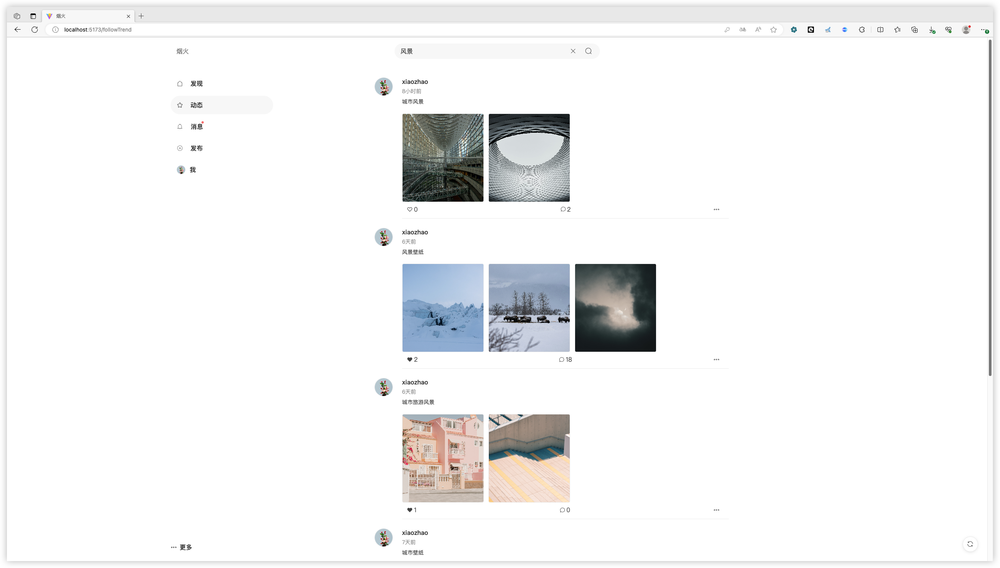
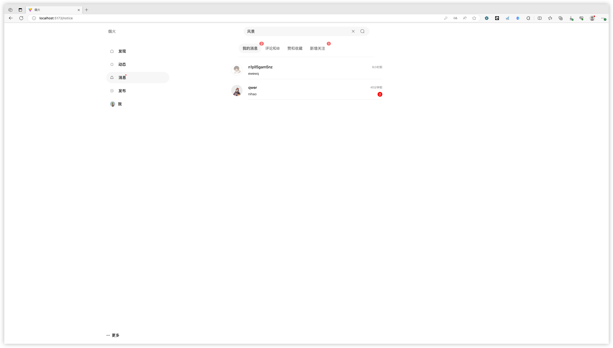
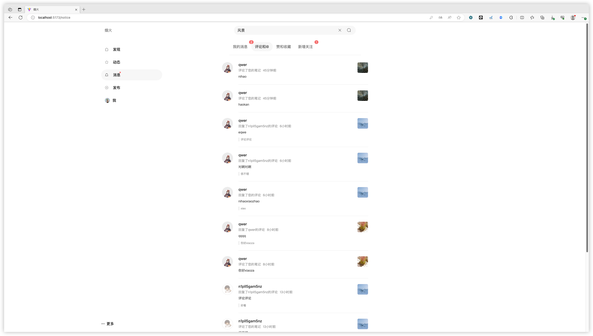
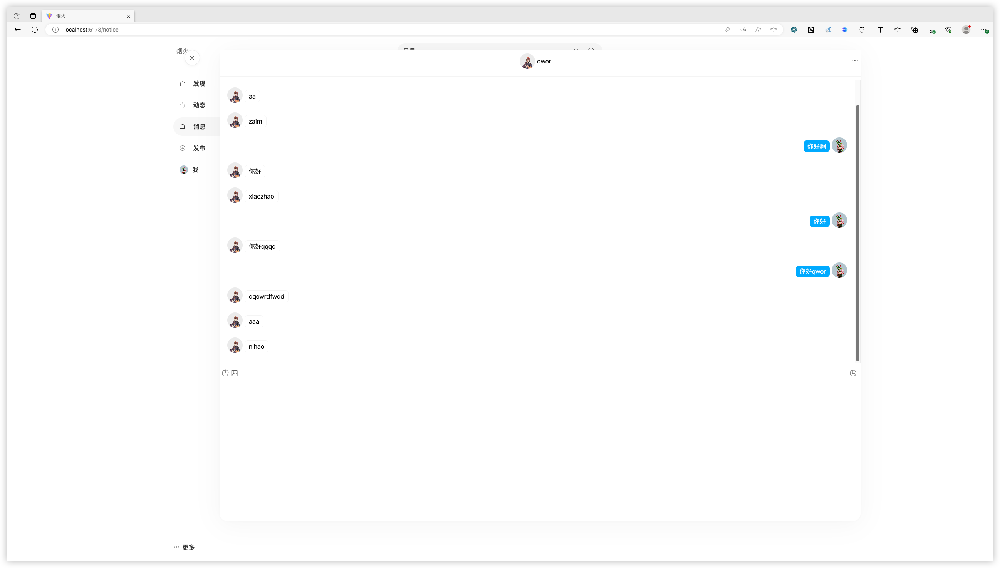
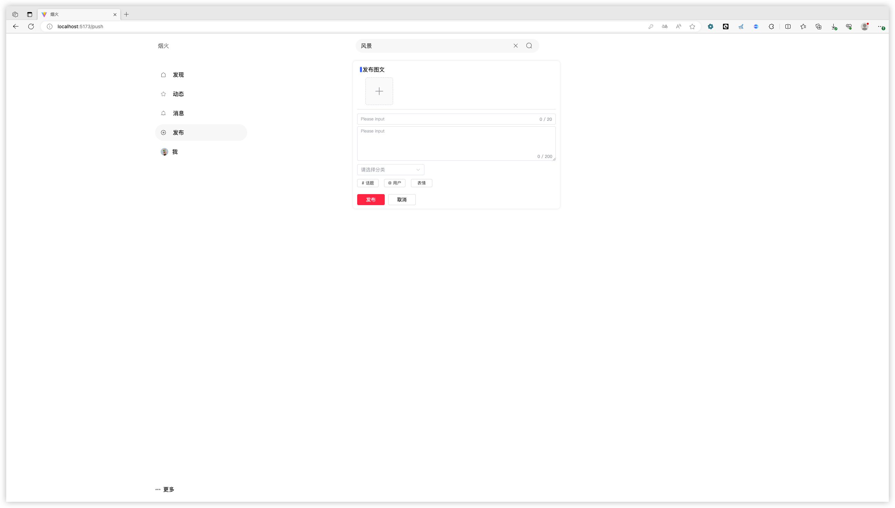

# 仿小红书web 1.0

<p align=center>
   仿小红书设计的一个基于微服务架构的前后端分离项目
</p>
<p align="center">

## 项目介绍
此项目**基于微服务架构的前后端分离系统**。**Web** 端使用 **Vue3** +**ts**+**ElementUi** 。后端使用 **SpringBoot** + **Mybatis-plus**进行开发，使用 **ElasticSearch**  作为全文检索服务，使用**webSocket**做聊天和消息推送。

- 所有功能都是自己一个开发完成，1.0版本可能还存在些小bug。
- **推荐项目** https://gitee.com/xzjsccz/yanhuo_dev   这是免费的开源app端仿小红书项目(最好还是学习web端小红书项目，uniapp小红书项目我不会更新了，uniapp太难用了，项目不好维护)
- **推荐项目** 如果想自己做一个仿小红书项目，我这里也提供了免费的前端仿小红书源码 https://gitee.com/xzjsccz/xiaohongshu

**数据库文件在`doc/yanhuo-test.sql`**

**这个项目尽量做得简单，所以没有考虑接口的性能，所有功能都是直接对数据库进行操作。后续会对接口慢慢优化...**

[微信]:**18572755162** [qq]:**484235492**
## 项目地址
http://ccimgvideo.top/

## API接口文档
https://console-docs.apipost.cn/preview/43d05f344c62117e/63d199bf052ccf41

## 运行启动

**前端启动**

下载项目进入`yanhuo-web`中

1.下载依赖
```agsl
yarn install 
```
2.启动项目
```agsl
npm run dev
```
3.启动成功后页面


**后端启动**

- 首先需要把`redis`，`elasticsearch`，`mysql` 安装好启动。

- 如果是本地上传，需要修改图片保存地址，不然上传图片会失败(默认使用七牛云存储)
  
- 如果是使用七牛云存储图片，需要配置七牛云的oss地址(默认使用七牛云存储，因此可以也可以不用修改本地文件地址)
  
- 修改每个项目下的数据库账号密码，如果有es账号密码需要修改 `yanhuo-search`下的配置文件
  
  
- 启动`yanhuo-auth`,`yanhuo-gateway`,`yanhuo-im`,`yanhuo-platform`,`yanhuo-search`,`yanhuo-util`即可运行项目。

- 启动项目后会发现没有任何数据，这是因为es中还没有同步数据，我们需要启动`xxl-job`（运行xxl-job这里就不展开了，去git上面搜索xxl-job然后下载下来更改数据库后就可以启动了）并配置数据
  - xxl-job添加执行器
    
  - 添加定时任务
    
  - 然后运行任务，观察日志运行情况，如果显示成功则数据同步成功
    
### 成功运行


## 测试账号
烟火web测试账号 xiaozhao \
烟火web测试密码 123456

烟火web测试账号 qwer \
烟火web测试密码 123456

烟火web测试账号 qwer1234 \
烟火web测试密码 123456

## 联系我
如果有什么问题可以加群讨论，群号：879599115


## 后期维护
这个项目尽量做得简单，所以没有考虑接口的性能，所有功能都是直接对数据库进行操作。后续会对接口慢慢优化。

## 项目特点及功能

- 使用springboot+mybatis_plus+vue3+ts+websocket技术
- 使用gateway做网关过滤，对发送的请求做过滤。（部分请求放行，比如登录请求，首页数据请求）
- 支持本地图片存储，七牛云存储。
- 使用ElasticSearch做内容搜索
- 使用websocket做私信聊天和实时通知
- 使用redis做对象缓存
- 采用elementui完成页面搭建

## 项目目录

- yanhuo-web 前段页面
- yanhuo-auth 认证服务
- yanhuo-common 公共模块,存放一些工具类或公用类
- yanhuo-platform 烟火app主要功能模块
- yanhuo-im 聊天模块
- yanhuo-search 搜索模块
- yanhuo-util  第三方服务模块，邮箱短信，oss对象存储服务
- yanhuo-xo  对象存放模块

## 技术选型

### 后端技术

|      技术       |      版本       |      
|:-------------:|:-------------: 
|  SpringBoot   | 2.3.2.RELEASE |  
|  openfeign	   |       -       |
| MyBatis-Plus  |       -       |          
| Elasticsearch |    7.16.3     |   
|     Redis     |     4.2.2     |
|      JWT      |     0.7.0     |                
|    Lombok     |       -       |
|     Nginx     |    1.12.2     |         
|    Hutool     |       -       |               
|   websocket   | 2.3.2.RELEASE |   

### 前端技术

|   技术    | 版本 |      
|:-------:|:--: 
| nodejs	 | -  |  
| vue3		  | -  |
| axios	  | -  |  
|  其他组件   | -  |  

## 项目截图

|                                 |                                 |
|:-------------------------------:|:-------------------------------:|
|   |   |
|  |  |
|  |  |
|  |  |
|  |  |
|  |  |

## 视频演示
https://www.bilibili.com/video/BV1kN4y1n7gz/?spm_id_from=333.1007.top_right_bar_window_history.content.click